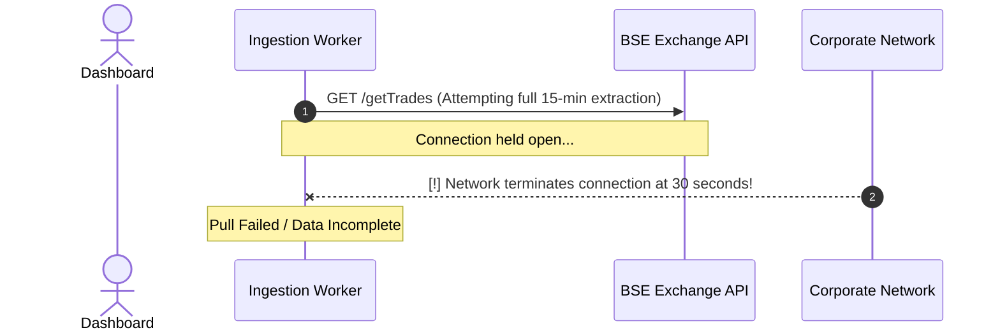
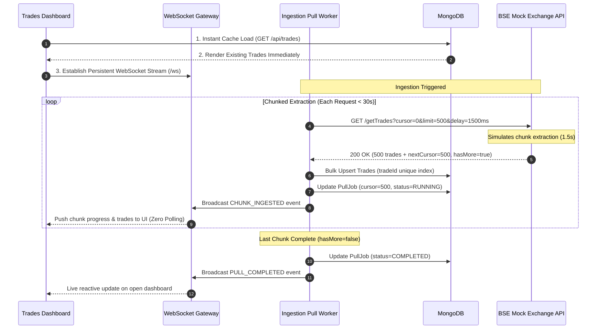

# Architecture Note: BSE Trade Ingestion System & Live Trades Dashboard

**Candidate Submission for ARHAM Fintech (Software Engineer Assessment)**

---

## 1. Problem Scenario & Core Challenge

### The Problem
* **Data Source**: BSE Exchange API (`GET /getTrades`) with seeded trade records (5,000+ trades).
* **Time to Pull**: A complete pull of all trade data takes up to **15 minutes**.
* **Network Constraint**: The corporate network **terminates HTTP connections that remain open for more than 30 seconds**.
* **Dashboard Requirements**:
  1. The dashboard must open **instantly**, displaying already-pulled trades even while a background pull is actively in progress.
  2. When a pull completes, new trades must appear on the open dashboard **automatically** — **strictly without page refreshes, without polling loops (`setInterval(fetch)`), and without cron jobs / schedulers**.

---

## 2. Why a Naive Approach Fails vs. Our Solution

### The Naive Approach (Fails)
A single monolithic HTTP request `GET /getTrades` that attempts to hold the connection open for 15 minutes will be abruptly dropped by the network proxy/firewall at the 30-second mark, causing total pull failure and 0 ingested trades.



---

### Our Chunked Cursor-Based Ingestion Architecture (Succeeds)
Instead of one long-lived connection, the Ingestion Engine breaks down the 15-minute dataset extraction into **discrete, sequential, paginated chunks** using cursor offsets. 
- Each individual chunk request completes in **1–3 seconds** (comfortably under the 30-second limit).
- The cumulative ingestion executes over the desired full timeframe without keeping any single HTTP connection open for more than a few seconds.



---

## 3. High-Level System Architecture

```
+---------------------------------------------------------------------------------------------------+
|                                      SYSTEM ARCHITECTURE                                          |
+---------------------------------------------------------------------------------------------------+

     +-----------------------+                         +-----------------------------------+
     |     Mock BSE API      |                         |         Ingestion Engine          |
     | (Simulated Exchange)  |    GET /getTrades       |         & Backend Server          |
     |                       |    ?cursor=0&limit=500  |                                   |
     | - 5,000+ Seeded Trades|<------------------------| - Discrete Chunk Puller (< 30s)   |
     | - Per-Chunk Delay     |    HTTP Response < 3s   | - Resilient Cursor Resumption     |
     | - Cursor Pagination   |------------------------>| - Timeout Abort Guard (< 28s)     |
     +-----------------------+                         +-----------------+-----------------+
                                                                         |
                                             Idempotent Upsert & State   |
                                                                         v
                                                          +-----------------------------+
                                                          |           MongoDB           |
                                                          | ├── trades (tradeId index)  |
                                                          | └── pullJobs (job state)    |
                                                          +-----------------------------+
                                                                         |
                                           WebSocket Live Stream         | Instant MongoDB
                                           (Push on Chunk / Done)        | Query on Open
                                                                         v
                                                          +-----------------------------+
                                                          |      Trades Dashboard       |
                                                          |     (Modern FinTech UI)     |
                                                          |                             |
                                                          | - Instant Cache Render      |
                                                          | - Zero Polling / Zero Cron  |
                                                          | - Sub-30s Telemetry Feed    |
                                                          | - Live Trade Book & Metrics |
                                                          +-----------------------------+
```

---

## 4. Key Components & Implementation Details

### A. Mock BSE Exchange API (`bse-mock-api/`)
* **Seeded Dataset**: 5,000 realistic Indian stock market trades generated with tickers (`RELIANCE`, `TCS`, `INFY`, `HDFCBANK`, etc.), client brokers (`Zerodha`, `Groww`, `ICICI Direct`, `HDFC Securities`), quantities, prices, and ISO timestamps.
* **Pagination & Delay Model**:
  - `GET /getTrades?cursor={offset}&limit={limit}&delayPerChunk={ms}`
  - Returns `{ trades: [...], nextCursor: 500, hasMore: true, totalRecords: 5000, chunkIndex: 1, totalChunks: 10 }`.
  - The delay is applied **per chunk** (e.g. 1.5s per 500 records), ensuring every single HTTP transaction takes only a few seconds while simulating the cumulative slow pull.

### B. Ingestion Engine & Resilient Worker (`ingestion-service/`)
* **MongoDB Collections**:
  1. `trades`: Stores trade documents indexed uniquely on `tradeId`. Upserts prevent duplicates if chunks are retried.
  2. `pullJobs`: Stores pull metadata for resilient resumption:
     ```json
     {
       "jobId": "job_1725102000000",
       "status": "RUNNING",
       "nextCursor": 1500,
       "recordsPulled": 1500,
       "totalRecords": 5000,
       "currentChunk": 3,
       "totalChunks": 10,
       "delayPerChunkMs": 1500,
       "startedAt": "2026-08-31T09:00:00.000Z",
       "updatedAt": "2026-08-31T09:00:05.000Z"
     }
     ```
* **Resilient Resumption Strategy**:
  - If the server restarts, encounters a network hiccup, or the user clicks "Pause", the worker persists the exact `nextCursor` in MongoDB.
  - Upon resumption, the worker queries `PullJob.findOne({ status: { $in: ['RUNNING', 'PAUSED'] } })` and continues directly from `nextCursor` (e.g. chunk 4 at cursor 1500) rather than restarting from chunk 1.
* **Timeout Guard**:
  - Every outbound HTTP fetch uses an `AbortController` with a strict 28-second timeout limit, guaranteeing no request can ever hang or violate the corporate 30-second network kill rule.

### C. Live Trades Dashboard (`dashboard/`)
* **Instant Load**: Reads existing trades from MongoDB upon page open in milliseconds (`GET /api/trades`), displaying trade book and statistics immediately even while background pulls are running.
* **Zero Polling & Zero Cron**:
  - Connects to native WebSocket endpoint (`ws://localhost:4000/ws`).
  - Listens for `CHUNK_INGESTED` and `PULL_COMPLETED` broadcast events.
  - Automatically updates progress bars, turnover statistics, and prepends new trades with glowing flash animations without page reload or `setInterval(fetch)` polling loops.
* **Live Telemetry Strip**: Displays real-time logging of each sub-30s HTTP chunk with latency metrics and safety verification tags.

---

## 5. Design Decisions & Trade-Offs

| Decision | Chosen Solution | Alternative Considered | Why this design was chosen |
| :--- | :--- | :--- | :--- |
| **Connection Timeout Solution** | Chunked Cursor Pagination (`cursor`, `limit`, `delayPerChunk`) | Single long-polling HTTP request | Single long HTTP request is killed by corporate network at 30 seconds. Chunked pagination keeps each connection under 3 seconds. |
| **Real-Time UI Updates** | WebSockets (`ws`) Event Push | HTTP Polling (`setInterval`) or Cron jobs | Assessment explicitly forbids polling loops and cronjobs. WebSockets push updates instantly with zero unnecessary overhead. |
| **Database** | MongoDB with Mongoose | Relational SQL / SQLite | High write throughput for bulk upserts; flexible JSON document model matching exchange feeds; clean document state tracking for `pullJobs`. |
| **Failure Recovery** | Resilient MongoDB Cursor Tracking | Stateless in-memory worker | In-memory tracking loses progress on crash or pause. MongoDB-persisted cursor enables exact point-in-time resumption. |
| **Data Integrity** | Idempotent `bulkWrite` with `tradeId` unique index | Naive `insertMany` | Prevents duplicate records during network retries or job resumption. |

---

## 6. Verification & Safety Verification

All architectural constraints were validated with automated integration tests:
1. **BSE Mock API Chunked Extraction**: Verifies `GET /getTrades` with cursor pagination returns chunks in < 5 seconds (well below 30s).
2. **MongoDB Ingestion & Idempotency**: Verifies 5,000 records ingested with 0 duplicate `tradeId` entries.
3. **Resilient Resumption**: Verifies pausing at cursor $N$ and resuming continues from cursor $N$ without restarting from 0.
4. **WebSocket Event Stream**: Verifies real-time event dispatching without HTTP polling loops.
