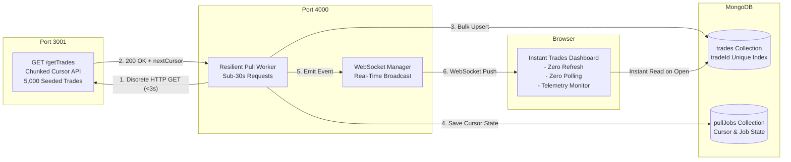

# BSE Trade Ingestion System & Real-Time Trades Dashboard

**Candidate Submission for ARHAM Fintech (Software Engineer Assessment)**  
**Author**: Pawan Shigwan  
**Target Email**: `chirag.g@arhamfintech.ai` | **CC**: `hr@arhamfintech.ai`

---

## 📌 Executive Summary & Problem Breakdown

### The Challenge
* **Source**: BSE Exchange API (`GET /getTrades`) with 5,000+ seeded trade records.
* **Duration Constraint**: A full dataset pull takes up to **15 minutes**.
* **Network Constraint**: The corporate network **terminates HTTP connections that remain open for more than 30 seconds**.
* **Dashboard Requirements**:
  1. Opens **instantly**, displaying already-pulled trades from MongoDB even while a background pull is actively in progress.
  2. When a pull completes, new trades appear on the open dashboard **automatically** — **strictly without page refreshes, without polling loops (`setInterval(fetch)`), and without cron jobs / schedulers**.

---

## 🏗️ Architecture & How the 30-Second Timeout is Solved

A single blocking HTTP connection held open for 15 minutes is abruptly terminated by the corporate network at 30 seconds.

### Our Solution: Chunked Cursor Ingestion + MongoDB Persistence + WebSocket Push
1. **Discrete Sub-30s Chunks & 15-Minute Simulation**: The mock BSE API supports configurable delays, while the ingestion engine uses cursor-based chunking to ensure individual HTTP requests remain below the 30-second network limit. The complete ingestion process can therefore simulate an operation lasting up to 15 minutes without maintaining a single long-lived HTTP request.
2. **Resilient MongoDB Resumption**: The `pullJobs` collection stores `nextCursor`, `status`, `recordsPulled`, and `totalChunks`. If paused or interrupted, the worker resumes exactly where it left off without re-fetching earlier chunks.
3. **Idempotent Upsert**: Trades are upserted into the `trades` collection by `tradeId` unique index to guarantee zero data duplication during retries or recovery.
4. **Reactive Push (Zero Polling / Zero Cron)**: A persistent **WebSocket** connection streams `CHUNK_INGESTED` and `PULL_COMPLETED` events straight to the dashboard, rendering live progress and incoming trades dynamically with glowing flash micro-animations.



For complete architectural details and trade-off analysis, see [ARCHITECTURE.md](file:///c:/Users/HP/OneDrive%20-%20Deccan%20Education%20Society/Desktop/Technical%20Assessment/ARCHITECTURE.md).

---

## 🚀 Quick Start & Installation

### Prerequisites
* **Node.js**: v18+ (tested on v20.x)
* **npm**: v9+
* **MongoDB**: Standard MongoDB daemon (`mongodb://127.0.0.1:27017`) OR **Zero-Setup Mode** (automatically launches an embedded MongoDB server in-memory if no local daemon is found!).

### 1. Install Dependencies
```bash
npm install
```

### 2. Start Both Services (Mock BSE API + Ingestion/Dashboard)
```bash
npm start
```
* **BSE Mock API**: `http://localhost:3001`
* **Trades Dashboard**: `http://localhost:4000`

---

## 🧪 Automated Testing

Run the full automated test suite verifying sub-30s latency safety, pagination, MongoDB storage, and resilient cursor resumption:

```bash
npm test
```

### Test Coverage Highlights:
* `BSE Seed Data Generator`: Validates 5,000+ realistic BSE trade objects.
* `BSE Mock API /getTrades`: Verifies chunked responses, cursor indexing, and sub-30s completion.
* `MongoDB Ingestion Worker`: Verifies bulk ingestion into `trades` and state tracking in `pullJobs`.
* `Resilient Resumption`: Verifies pausing at cursor $N$, resuming from cursor $N$, and asserting 0 duplicate records in MongoDB.

---

## 🖥️ Live Dashboard Walkthrough & Features

1. **Instant Cold Start**:
   * Open `http://localhost:4000`.
   * Stored trades render in milliseconds from MongoDB.
2. **Simulation Speed Control**:
   * Choose between *Fast Demo (1.5s/chunk)*, *Ultra Fast (0.5s/chunk)*, or *Full Multi-Minute Exchange Delay*.
3. **Trigger Ingestion**:
   * Click **Start Full Pull**.
   * Observe the live progress bar, record counters, and real-time trade count tickers.
4. **Verify Zero Polling**:
   * Open Chrome DevTools -> **Network Tab** -> Filter by **Fetch/XHR**.
   * Notice that **NO HTTP polling loops** (`setInterval`) are occurring.
   * Switch to the **WS (WebSocket)** tab to inspect real-time pushed event frames (`CHUNK_INGESTED`, `PULL_COMPLETED`).
5. **Test Resilient Resumption**:
   * Click **Pause** mid-pull. Observe status switch to `PAUSED` and cursor position preserved.
   * Click **Resume from Cursor**. The engine resumes directly from the stored cursor without restarting from chunk 1.
6. **Sub-30s Telemetry Monitor**:
   * The live telemetry feed displays every single chunk request duration (e.g. `1,480ms`), confirming that each discrete connection completes well within the 30-second network kill threshold.

---

## 📁 Repository Structure

```
├── bse-mock-api/
│   ├── seedData.js              # 5,000+ realistic BSE trade generator
│   └── server.js                # Mock BSE API server (port 3001)
├── ingestion-service/
│   ├── config.js                # Configuration (ports, batch sizes, timeouts)
│   ├── db.js                    # MongoDB connector with automatic in-memory fallback
│   ├── models/
│   │   ├── Trade.js             # Mongoose schema for trades (tradeId indexed)
│   │   └── PullJob.js           # Mongoose schema for cursor & job state
│   ├── pullWorker.js            # Resilient chunked pull orchestrator (< 30s)
│   ├── wsServer.js              # WebSocket broadcast server
│   └── server.js                # Express REST API + WebSocket server (port 4000)
├── dashboard/
│   ├── index.html               # Modern FinTech UI
│   ├── styles.css               # Glassmorphism dark theme, micro-animations
│   └── app.js                   # Reactive WebSocket client, instant render
├── tests/
│   ├── bse-api.test.js          # BSE API & pagination tests
│   └── ingestion.test.js        # MongoDB ingestion & cursor resumption tests
├── ARCHITECTURE.md              # In-depth architecture design & trade-offs
├── README.md                    # Setup and evaluation documentation
├── run-all.js                   # Unified process runner
└── package.json                 # Project manifest & scripts
```

---


